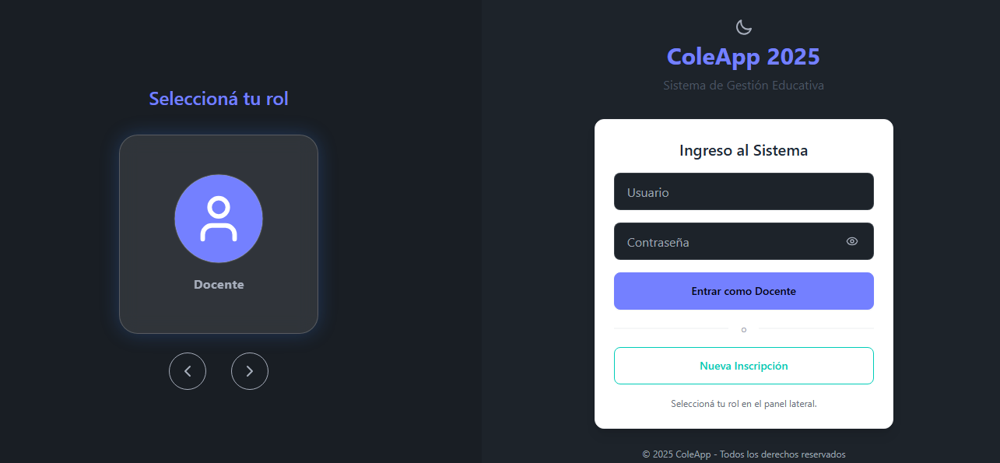
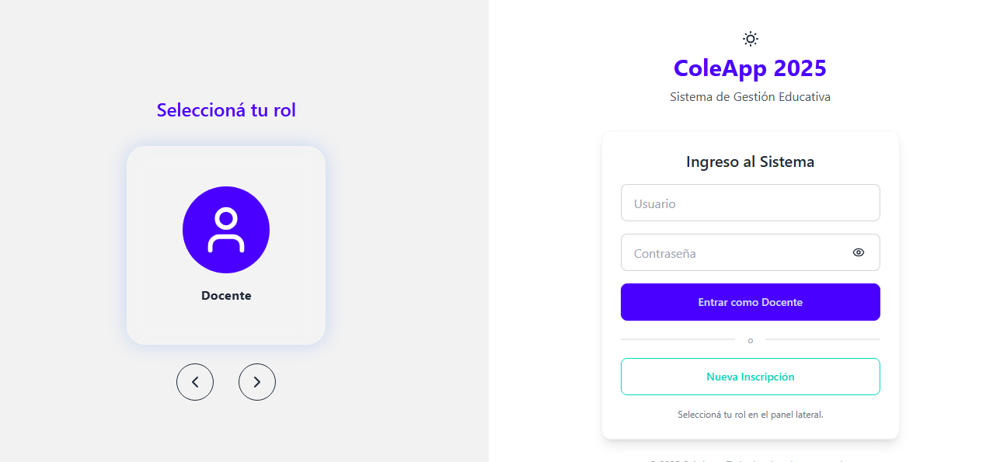
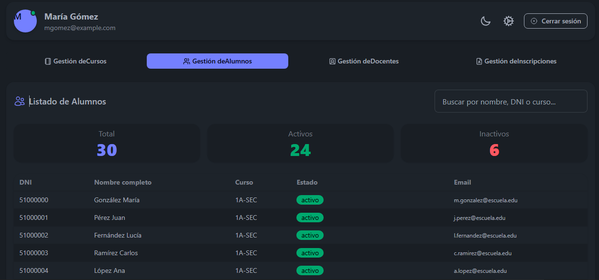
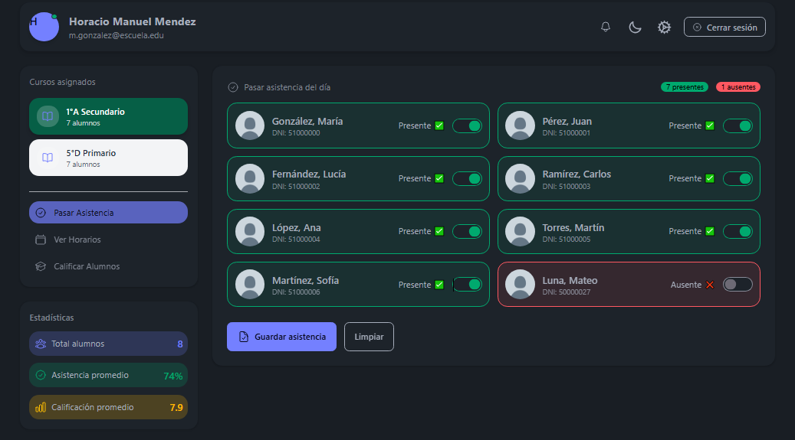
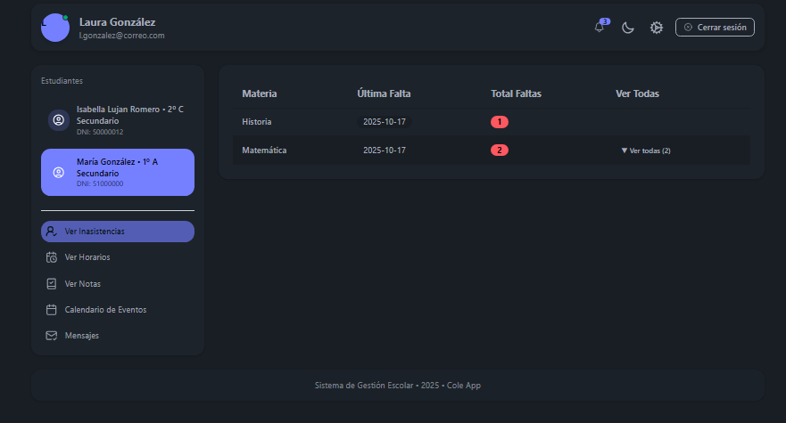
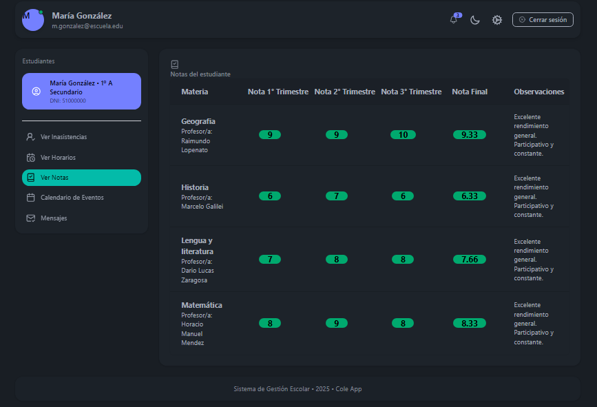

# ColeApp 2025 — 2025 UTN GRUPO 3


[](./LICENSE)

## Tabla de Contenidos

-   [Descripción General](#descripción-general)
-   [Tecnologías Utilizadas](#tecnologías-utilizadas)
    -   [Frontend](#frontend-react--cra)
    -   [Backend](#backend-nodejs--express)
    -   [Infraestructura](#Infraestructura)
-   [Arquitectura del sistema](#arquitectura-del-sistema)
-   [Estructura del Proyecto](#estructura-del-proyecto)
-   [Instalación y Ejecución](#instalación-y-ejecución)
    -   [Requisitos Previos](#1-requisitos-previos)
    -   [Clonar Repositorio](#2-clonar-el-repositorio)
    -   [Configurar Variables deEntorno](#3-configurar-variables-de-entorno)
    -   [Ejecutar con Docker](#4-construir-y-levantar-los-contenedores)
    -   [Ejecutar sin Docker](#5-ejecutar-sin-docker)
-   [Como usar a aplicacion](#como-usar-a-aplicacion)
-   [Comandos útiles](#comandos-útiles)
-   [Troubleshooting](#troubleshooting)
-   [Capturas de Pantalla](#capturas-de-pantalla)
-   [Equipo de Desarrollo](#equipo-de-desarrollo)
-   [Licencia](#licencia)


## Descripción General
Proyecto fullstack desarrollado para la materia **Desarrollo de Software**, correspondiente al tercer año de la carrera de Ingenieria en sistemas de información de la Universidad Tecnológica Nacional - Facultad Regional La Plata.
Incluye un **frontend en React** y un **backend en Node.js + Express + SQLite**, dockerizado para facilitar la ejecución en cualquier entorno.
El proyecto fue desarrollado con la finalidad de conseguir una correcta gestion academica para una escuela (nivel primario y secundario). Abarca:
    - Cursos: Gestion de alumnos
    - Alumnos: Seguimiento sobre la trayectoria escolar
    - Profesores: Gestión de calificaciones, inasistencias
    - Directivos: Manejo de solicitudes de inscripción
    - Tutores: Seguimiento de la trayectoria escolar de un alumno a cargo
Objetivo: Optimizar la administración escolar a través de la tecnología

## Tecnologías Utilizadas

### Frontend (React + CRA)
- **React 19**  
  Interfaz principal del sistema, creada con *Create React App (react-scripts 5)*.
- **React Router DOM 7**  
  Manejo de rutas, navegación por roles y páginas protegidas.
- **TailwindCSS + DaisyUI**  
  Framework de estilos y componentes UI preconstruidos.
- **Axios**  
  Cliente HTTP para consumir la API del backend.
- **Framer Motion**  
  Animaciones suaves en sliders, transiciones y elementos interactivos.
- **React-Toastify**  
  Notificaciones visuales (exitos, errores, alertas).
- **FullCalendar (DayGrid, TimeGrid, List)**  
  Gestión interactiva de calendarios, horarios y eventos.
- **Lucide-React / HeroIcons**  
  Iconografía SVG moderna.
- **Tippy.js**  
  Tooltips y elementos flotantes.

---

### Backend (Node.js + Express)
- **Node.js + Express 5**  
  API REST modular para servicios de usuarios, cursos, notas, asistencias, etc.
- **Better-SQLite3**  
  Base de datos SQLite con acceso síncrono y eficiente para producción liviana.
- **JWT (jsonwebtoken)**  
  Autenticación con Access Token y Refresh Token.
- **bcrypt**  
  Hashing seguro de contraseñas.
- **cookie-parser**  
  Manejo de cookies *httpOnly* para el refresh token.
- **multer**  
  Manejo de archivos (documentos).
- **dotenv**  
  Gestión de variables de entorno.
- **CORS**  
  Seguridad para comunicación frontend-backend.
---

### Infraestructura
- **Docker + Docker Compose**  
  Orquestación del frontend, backend y base de datos.
- **Git + GitHub**  
  Control de versiones, trabajo colaborativo y gestión de issues.


## Arquitectura del sistema

[Ver diagrama de arquitectura](./docs/diagrams/arquitectura.md)

## Estructura del proyecto
    2025-UTN-GRUPO-3/
    ├── frontend/
    │   ├── src/
    │   │   ├───── components/
    │   │   ├───── context/
    │   │   ├───── pages/
    │   │   ├───── services/
    │   │   ├───── utils/
    │   │   ├───── App.js
    │   │   ├───── index.js
    │   │   ├───── index.css
    │   ├── .dockerignore
    │   ├── package.json
    │   ├── Dockerfile
    │   └── .env
    ├── backend/
    │   ├── config/
    │   ├── controllers/
    │   ├── db/
    │   ├── routes/
    │   ├── .dockerignore
    │   ├── .env
    │   ├── Dockerfile
    │   ├── package.json
    │   ├── Server.js
    ├── docker-compose.yml
    ├── README.md
    ├── docs/
    │   ├── AlcanceDelProyecto.md
    │   ├── Autenticacion.md
    │   ├── screenshots/
    └───┴── diagrams/ 

## Instalación y ejecución

### 1. Requisitos previos
Instalar: 

- [Docker](https://www.docker.com/)
- [Node.js 18+](https://nodejs.org/en)
- [Git](https://git-scm.com/)

### 2. Clonar el repositorio
```bash
git clone https://github.com/nico03lab/2025-UTN-GRUPO-3.git
cd 2025-UTN-GRUPO-3
```

### 3. Configurar variables de entorno:
En el **backend**, crear el archivo `.env` con el siguiente contenido:
```bash
    # CONFIGURACIÓN GENERAL
    APP_NAME=ColeApp
    PORT=3002
    NODE_ENV=development
    DB_PATH=./db/sistema_escolar.db
    CLIENT_ORIGIN=http://localhost:3000

    # JWT
    JWT_ACCESS_SECRET=COLEAPP_ACCESS_KEY_SUPER_SECRETA_2025
    JWT_REFRESH_SECRET=COLEAPP_REFRESH_KEY_SUPER_SECRETA_2025
    JWT_ACCESS_TTL=15m
    JWT_REFRESH_TTL=7d

    # COOKIES
    COOKIE_ACCESS=coleapp_access_token
    COOKIE_REFRESH=coleapp_refresh_token
```

En el **frontend**, crear el archivo .env con el siguiente contenido
```bash
    REACT_APP_API_URL=http://backend:3002
    PORT=3000
    NODE_ENV=development
```

### 4. Construir y levantar los contenedores
```bash
	docker compose up --build
```

Este comando:
- Construye las imágenes del **frontend** y **backend**.  
- Crea la red interna (`appnet`).  
- Levanta ambos servicios en paralelo.

Verificar que todo funcione
- Frontend → [http://localhost:3000](http://localhost:3000)  
- Backend → [http://localhost:3002](http://localhost:3002)

### 5. Ejecutar sin docker
 Backend
```bash
    cd backend
    npm install
    node server.js
```

 Frontend
```bash
    cd frontend
    npm install
    npm start
```

## Como usar a aplicacion

1. Abrí el navegador en: **http://localhost:3000**
2. Seleccioná un rol: **Alumno**, **Tutor**, **Docente** o **Directivo**
3. Iniciá sesión usando uno de los usuarios de testing:

### Credenciales de prueba

#### Directivo
- **Usuario:** mGomez  
- **Contraseña:** dir-001

#### Docente
- **Usuario:** HMMendez  
- **Contraseña:** doc-001

#### Tutor
- **Usuario:** lauraGonzalez  
- **Contraseña:** tut-001

#### Alumno
- **Usuario:** mariaGon33  
- **Contraseña:** est-001

4. Accedé al panel correspondiente según el rol elegido.


## Comandos útiles
Detener la ejecución
```bash
Ctrl + C
docker compose down
```

Limpiar todo (contenedores, imágenes y volúmenes)
```bash
docker compose down --rmi all --volumes
```

Levantar en segundo plano (modo daemon)
```bash
docker compose up -d
```

Ver contenedores activos:
```bash
docker ps
```

Ver logs en tiempo real:
```bash
docker compose logs -f
```

## Troubleshooting

### 1. Error: "address already in use :3000"

```bash
    npx kill-port 3000
```
### 2. Error al instalar dependencias

**Síntomas:**  
- `npm install` se rompe  
- Módulos corruptos  
- Advertencias de versiones incompatibles  

**Solución:**
```bash
rm -rf node_modules
npm cache clean --force
npm install
```
### 3. Cambio el `.env` pero no se reflejan los cambios

**Causa:** React y Node no recargan variables automáticamente.

**Solución:**
Apagar todo:
   ```bash
   docker compose down
   ```
Reconstruir:
   ```bash
   docker compose up --build
   ```
### 4. SQLite: `no such table`, `database is locked`, `path not found`

**Causas habituales:**
- `DB_PATH` apunta mal  
- Docker carga un volumen vacío  
- Estructura de tablas cambiada recientemente  

**Solución:**
Confirmar que el archivo exista:
   - `backend/db/sistema_escolar.db`
Revisar `.env`:
   ```env
   DB_PATH=./db/sistema_escolar.db
   ```
Reiniciar contenedores:
   ```bash
   docker compose down
   docker compose up --build
   ```
### 5. Error de CORS (`CORS policy blocked`)

**Solución:**
- Confirmar que el backend tenga CORS activado:
  ```js
  const cors = require("cors");
  app.use(cors());
  ```
- Revisar la URL en el frontend:
  ```env
  REACT_APP_API_URL=http://localhost:3002
  ```

## Capturas de Pantalla

### Login (dark theme)


### Login (Light theme)


### Panel de directivos


### Panel de docentes


### Panel de padres/tutores


### Panel de alumnos


## Equipo de desarrollo

#### Martinez Yanina         | Usuario GitHub: https://github.com/yamartinez03
#### Morinigo Roger          | Usuario GitHub: https://github.com/rfmorinigo
#### Laborde Nicolas         | Usuario GitHub: http://github.com/nico03lab
#### Ciardullo Geraldine     | Usuario GitHub: https://github.com/geral912

## Licencia

Este proyecto está bajo la **MIT License**.

[Ver Licencia](./LICENSE)