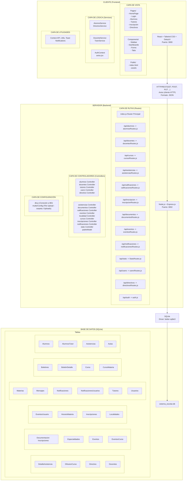

```mermaid
graph TD
    subgraph "CLIENTE (Frontend)"
        A["React + Tailwind CSS + DaisyUI<br>Puerto: 3000"]
        
        subgraph "CAPA DE VISTA"
            B1["Pages/<br>- HomePage<br>- Login<br>- Alumnos<br>- Tutores<br>- Inscripción<br>- Directivos"]
            B2["Components/<br>- Sidebar<br>- Dashboards<br>- Forms<br>- Tabs"]
            B3["Public/<br>- index.html<br>- assets"]
        end
        
        subgraph "CAPA DE LÓGICA (Services)"
            C1["AlumnoService<br>DirectivoService"]
            C2["DocenteService<br>TutorService"]
            C3["AuthContext<br>axios.jsx"]
        end
        
        subgraph "CAPA DE UTILIDADES"
            D["Context API, Utils, Toast Notifications"]
        end
    end
    
    A --> E["HTTP/REST(GET, POST, PUT…)<br>Axios (cliente HTTP)<br>Formato: JSON"]
    
    subgraph "SERVIDOR (Backend)"
        F["Node.js + Express.js<br>Puerto: 3002"]
        
        subgraph "CAPA DE RUTAS (Routes)"
            G1["index.js Router Principal"]
            G2["/api/alumnos -> alumnosRoutes.js"]
            G3["/api/docentes -> docentesRoutes.js"]
            G4["/api/cursos -> cursosRoutes.js"]
            G5["/api/asistencias -> asistenciasRoutes.js"]
            G6["/api/calificaciones -> calificacionesRoutes.js"]
            G7["/api/inscripcion -> inscripcionRoutes.js"]
            G8["/api/documentos -> documentosRoutes.js"]
            G9["/api/eventos -> eventosRoutes.js"]
            G10["/api/notificaciones -> notificacionesRoutes.js"]
            G11["/api/stats -> StatsRoutes.js"]
            G12["/api/users -> usersRoutes.js"]
            G13["/api/directivos -> directivosRoutes.js"]
            G14["/api/auth -> auth.js"]
        end
        
        subgraph "CAPA DE CONTROLADORES (Controllers)"
            H1["alumnos Controller<br>docentes Controller<br>tutores Controller<br>users Controller<br>directivo Controller"]
            H2["asistencias Controller<br>documentos Controller<br>calificaciones Controller<br>eventos Controller<br>localidad Controller<br>cursos Controller<br>inscripciones Controller<br>notificaciones Controller<br>stats Controller<br>padreModel"]
        end
        
        subgraph "CAPA DE CONFIGURACIÓN"
            I["db.js (Conexión a BD)<br>multerConfig (File Upload - carpeta: /Uploads)"]
        end
    end
    
    E --> F
    
    F --> J["SQLite <br>Driver: better-sqlite3"]
    
    subgraph "BASE DE DATOS (SQLite)"
        K["sistema_escolar.db"]
        
        subgraph "Tablas"
            subgraph COL3[" "]
                direction TB
                L9["DetalleAsistencia"]
                L10["DifusionCurso"]
                L11["Directivo"]
                L12["Docentes"]
            end
            subgraph COL4[" "]
                direction TB
                L13["Documentacion Inscripciones"]
                L14["Especialidades"]
                L15["Eventos"]
                L16["EventosCurso"]
            end
        
            %% COLUMNA 5
            subgraph COL5[" "]
                direction TB
                L17["EventosUsuario"]
                L18["HorarioMateria"]
                L19["Inscripciones"]
                L20["Localidades"]
            end
            subgraph COL6[" "]
                direction TB
                L21["Materias"]
                L22["Mensajes"]
                L23["Notificaciones"]
                L24["NotificacionesUsuarios"]
                L25["Tutores"]
                L26["Usuarios"]
            end
            subgraph COL2[" "]
                direction TB
                L5["Boletines"]
                L6["BoletinDetalle"]
                L7["Curso"]
                L8["CursoMateria"]
            end
            subgraph COL1[" "]
                direction TB
                L1["Alumnos"]
                L2["AlumnosTutor"]
                L3["Asistencias"]
                L4["Aulas"]
            end
        end
    end
    
    J --> K
```
