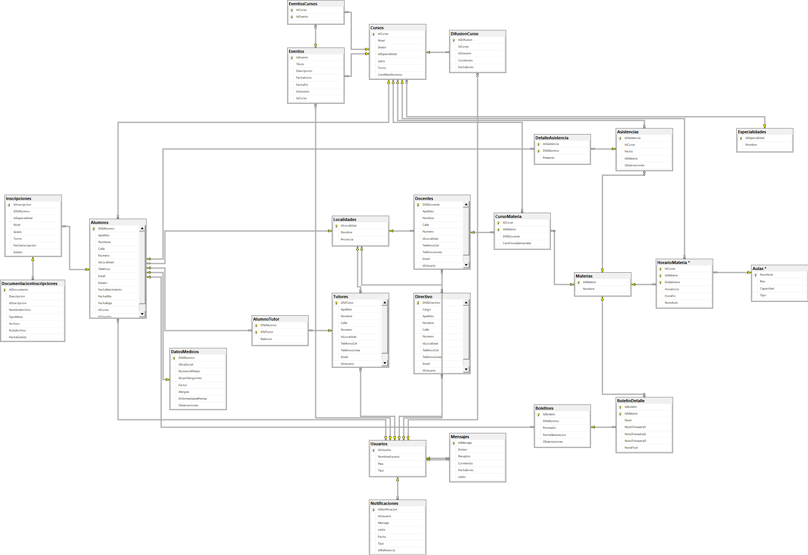

## Ejecución del Proyecto

### Instalar dependencias en /backend y /frontend:

`npm install`


### Configurar variables en .env (ejemplo en backend/.env):

```
DB_PATH=./db/sistema_escolar.db
PORT=3002
```


### Levantar el servidor backend:

`node server.js`


### Levantar el frontend:

`npm start`


## Base de datos

### Modificaciones

Modificar estructura en el archivo /backend/db/schema_update.sql.
Actualizar el archivo /backend/db/seed-data.js

### Nueva DB
Para generar nuevo archivo db, ejecutar el script seed-data.js desde el directorio /backend:

`2025-UTN-GRUPO-3\backend> node db/scripts/seed-data.js`

### Modelo Relacional Actual


